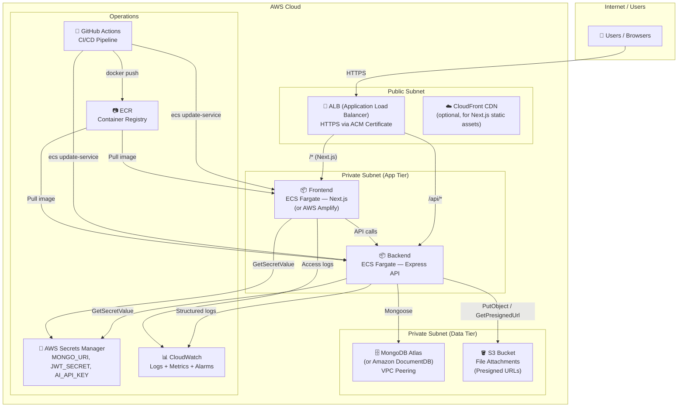

# AWS Hosting Architecture

## Diagram

---

## Hosting Explanation (~500 words)

### Frontend — ECS Fargate or AWS Amplify
The Next.js application is containerised and pushed to **Amazon ECR**, then deployed to
**ECS Fargate** on a private subnet. An **Application Load Balancer (ALB)** in the public
subnet terminates HTTPS (certificate managed by **AWS Certificate Manager / ACM**) and
reverse-proxies traffic to the Fargate task. Alternatively, **AWS Amplify** can host
Next.js with zero-config SSR support, automatic branch deploys, and built-in CDN — a
simpler choice if the team prefers a managed PaaS.

### API — ECS Fargate (App Runner optional)
The Express API runs as a separate ECS Fargate service behind the same ALB (path rule
`/api/*` routes to the API target group). Fargate is chosen over EC2 because there are
no servers to patch and tasks auto-scale via a **Fargate Auto Scaling** policy tied to
CPU/memory CloudWatch alarms. **AWS App Runner** is an even simpler alternative for the
MVP — it builds and deploys from ECR automatically with built-in load balancing and
health checks.

### Database — MongoDB Atlas (recommended) or Amazon DocumentDB
**MongoDB Atlas** (deployed into the same AWS region) is connected via **VPC Peering**
so traffic never leaves the private network. Atlas provides automated daily snapshots,
point-in-time recovery, and a free ops-manager UI. Alternatively, **Amazon DocumentDB**
(MongoDB-compatible) can be used entirely within AWS, simplifying IAM and compliance —
though it lags behind MongoDB's latest features.

### File Attachment Storage — S3 with Presigned URLs
File uploads are stored in a private **S3 bucket** (no public access). The API generates
a short-lived **presigned PUT URL** (upload) and **presigned GET URL** (download) per
request. This keeps credentials off the client and means the file bytes go directly
S3 → client without passing through the API server — a clean separation that the MVP
code already anticipates with the `buildAttachmentMeta()` abstraction.

### Secrets Management — AWS Secrets Manager
All sensitive values (`MONGO_URI`, `JWT_SECRET`, `AI_API_KEY`) are stored in
**AWS Secrets Manager**. The ECS task IAM role has `secretsmanager:GetSecretValue`
permission for the specific secret ARNs. Secrets are injected as environment variables
at task startup via the ECS `secrets` field — no secrets in Docker images or Git.

### Networking
- **ALB** lives in the public subnet, listens on port 443.
- **Fargate tasks** live in private subnets with no inbound internet access.
- A **NAT Gateway** allows tasks to make outbound calls (AI API, Atlas).
- **Security groups** restrict: ALB → Fargate on app port only, Fargate → DB on
  MongoDB port only.

### Logging & Monitoring — CloudWatch
All containers stream structured JSON logs to **CloudWatch Logs** via the `awslogs`
driver. **CloudWatch Alarms** trigger on: API 5xx error rate > 1 %, memory > 80 %,
stalled ticket count (from a scheduled Lambda hitting `/api/dashboard/stats`). An
optional **Grafana** integration can visualise CloudWatch metrics.

### CI/CD — GitHub Actions
The pipeline on every `main` push:
1. Runs `npm test` (Jest + Supertest with MongoDB Memory Server).
2. Builds Docker images for `frontend` and `backend`.
3. Pushes images to **ECR** with the Git SHA as the tag.
4. Calls `aws ecs update-service --force-new-deployment` for both services.
5. A post-deploy smoke test hits `/health` on the ALB.

Rollback is achieved by re-deploying the previous ECR image tag.

### DB Backups
MongoDB Atlas automated snapshots run daily with 7-day retention. DocumentDB also
supports automated backups with a configurable retention window (1–35 days). For either,
a point-in-time restore can recover from accidental data loss within the retention window.
